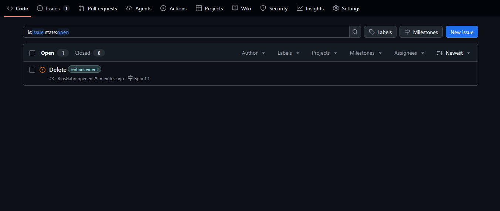
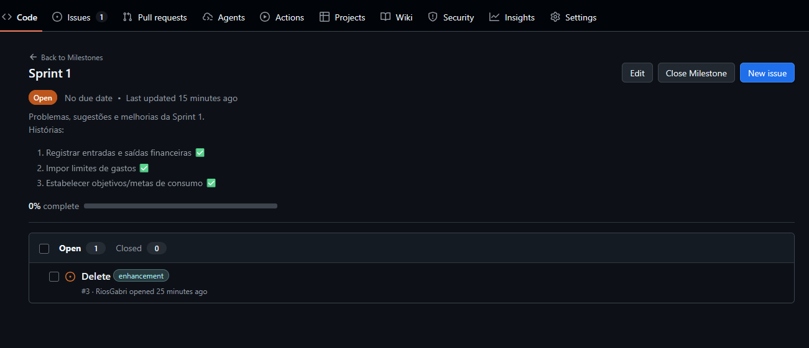

# Organizei

Aplicação web de gestão financeira pessoal: controle de gastos, investimentos, metas e assinaturas.

**Repositório:** [github.com/DoctahW/organizei](https://github.com/DoctahW/organizei)
**Disciplina:** Fundamentos de Desenvolvimento de Software — Turma 2B — 2026.1

---

## Entrega 01 — 09/03/2026

### Histórias de Usuário

Documento com as 9 histórias de usuário e critérios de aceitação em BDD (Dado / Quando / Então):
[Acessar documento](https://docs.google.com/document/d/1egnmUUYxPPLPzJMuwT_RmfhdqImwkjjIUY5sBWSnhy4/edit?usp=sharing)

### JIRA — Sprint e Backlog

### Protótipos Lo-Fi

Protótipos de baixa fidelidade no Figma cobrindo 5 histórias:
[Acessar no Figma](https://www.figma.com/design/j0wEhFfWl55RNM137RW6rR/ORGANIZEI_Lo-Fi?node-id=0-1&t=34MYVU5atat7Rbxn-1)

### Screencast — Protótipo Lo-Fi

Apresentação do protótipo com áudio e legenda:
[Assistir no YouTube](https://youtu.be/tkBOIxoyT6g)

---

## Entrega 02 - 30/03/2026

### Implementação de 3 histórias iniciais (Sprint 1)
1. Registrar entradas e saídas financeiras ✅
2. Impor limites de gastos ✅
3. Estabelecer objetivos/metas de consumo ✅

### Issues/bug tracker (GitHub)
Os problemas e sugestões foram classificados de acordo com categorias (bug, enhancement, etc) e milestones de acordo com cada sprint.

#### Issues

<!-- atualizar imagem -->

#### Milestones

<!-- atualizar imagem -->

### Deploy
[Link de acesso]() <!-- adicionar link -->

[Vídeo do sistema funcionando em deploy]() <!-- adicionar link do youtube -->
#### Como acessar:
Explicar como acessar.

### Programação em Par
Dividimos o grupo em três duplas, com cada dupla responsável por uma história. Cada integrante da dupla escolheu uma área de atuação para focar (Front-end ou Back-end), mas independente da área escolhida, todos se ajudaram na revisão das funcionalidades implementadas.

1. **Registrar entradas e saídas financeiras (Larissa e Gabriel)**

    O desenvolvimento foi iniciado com a criação do modelo referente ao formulário de inserção de uma nova transação. A implementação ocorreu de forma colaborativa e alternada, à medida que cada etapa do código era concluída.

    Inicialmente, Larissa ficou responsável pela construção do formulário em HTML e pela implementação das rotas do tipo POST. Em seguida, Gabriel deu continuidade ao trabalho, finalizando a rota do tipo GET e realizando as demais integrações necessárias com o banco de dados.

    Posteriormente, os demais integrantes do grupo conduziram a revisão das alterações realizadas, promovendo ajustes relacionados à integração com outras partes do sistema, incluindo interfaces e rotas do projeto.
  
2. **Impor limites de gastos (Vinícius e Heitor)**
3. **Estabelecer objetivos/metas de consumo (Ariel e Euclides)**

    O desenvolvimento foi iniciado com base no modelo do formulário de estabelecer objetivo/meta de consumo. A implementação ocorreu de forma colaborativa e alternada: em cada entrega, um integrante ficara responsável pelo backend enquanto o outro cuidava do frontend.
   
    Nesta etapa, Euclides ficou encarregado da construção do app goals no Django, desenvolvendo os códigos do backend e integrando-os funcionalmente ao HTML. Em seguida, Ariel deu continuidade ao trabalho refinando a interface visual com CSS e reorganizando a estrutura do HTML, tornando a apresentação do app mais harmoniosa e coesa.

    Por fim, os demais integrantes do grupo conduziram a revisão das alterações realizadas, promovendo ajustes de integração com outras partes do sistema, como interfaces e rotas do projeto.

### Próximos passos: Quadro da Sprint 2
 <!-- adicionar foto -->

## Equipe

<!-- ALL-CONTRIBUTORS-LIST:START - Do not remove or modify this section -->
<!-- prettier-ignore-start -->
<!-- markdownlint-disable -->
<table>
  <tbody>
    <tr>
      <td align="center" valign="top" width="14.28%"><a href="https://github.com/ariel-cs"> <b>Ariel</b></a> <a href="https://github.com/DoctahW/organizei/commits?author=ariel-cs" title="Code">💻</a></td>
      <td align="center" valign="top" width="14.28%"><a href="https://github.com/Torzinus"> <b>Heitor de Carvalho</b></a> <a href="https://github.com/DoctahW/organizei/commits?author=Torzinus" title="Code">💻</a></td>
      <td align="center" valign="top" width="14.28%"><a href="https://github.com/venici-o"> <b>Vinicius</b></a> <a href="https://github.com/DoctahW/organizei/commits?author=venici-o" title="Code">💻</a></td>
      <td align="center" valign="top" width="14.28%"><a href="https://larissagiovanna.github.io/LarissaGiovanna/"> <b>Larissa Giovanna</b></a> <a href="https://github.com/DoctahW/organizei/commits?author=LarissaGiovanna" title="Code">💻</a></td>
      <td align="center" valign="top" width="14.28%"><a href="https://github.com/RiosGabri"> <b>Gabriel Parméra</b></a> <a href="https://github.com/DoctahW/organizei/commits?author=RiosGabri" title="Code">💻</a></td>
      <td align="center" valign="top" width="14.28%"><a href="https://github.com/DoctahW"> <b>João Euclides</b></a> <a href="https://github.com/DoctahW/organizei/commits?author=DoctahW" title="Code">💻</a></td>
    </tr>
  </tbody>
</table>

<!-- markdownlint-restore -->
<!-- prettier-ignore-end -->

<!-- ALL-CONTRIBUTORS-LIST:END -->
